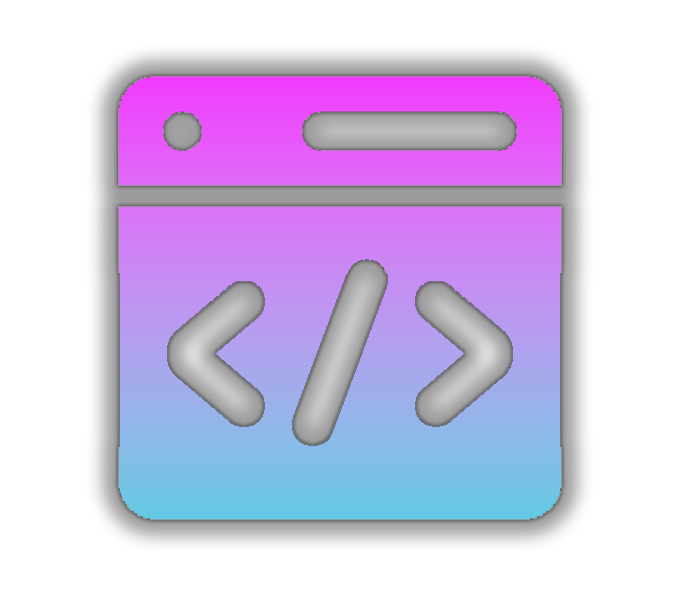
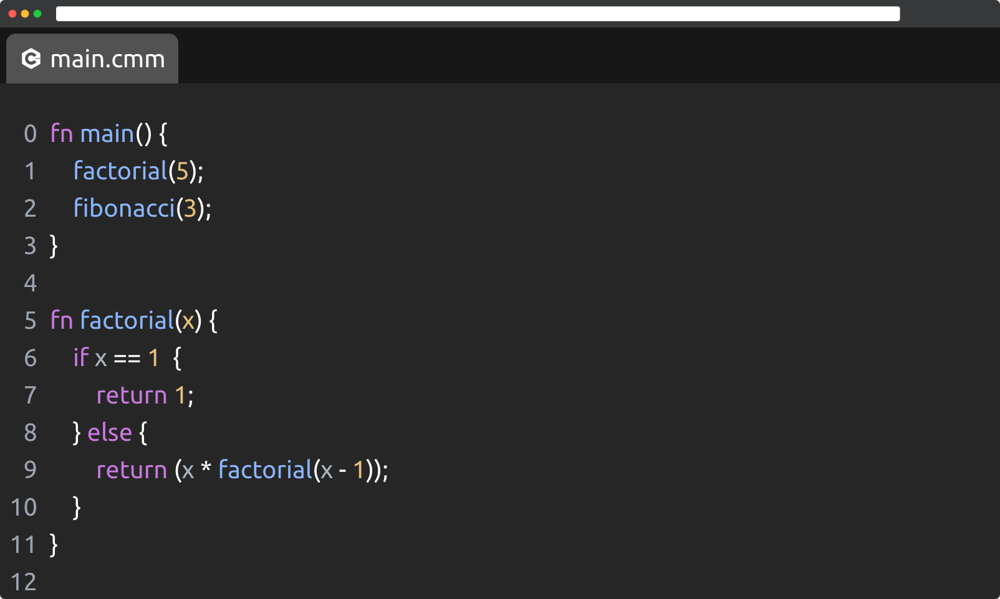

<p align="center">
  
</p>


<h1 align="center">Lightweight code editor powered by finite automata</h1>

<p style="text-align: center;">
    <em>
        A project by Achraf Yandouzi, Flor Ronsmans De Vry, Jonas Caluwé and Maxime Ruys
    </em>
</p>

---

<div style="display: flex; justify-content: center; align-items: center; height: 35vh;">
    
</div>

---

## Technologies used

-  C++
-  TypeScript
-  React
-  Tailwind CSS
-  Python

## Project structure

```
|
|-- core (C++) - Core package that handles syntax highlighting and autocomplete logic
|   |-- ...
|
|-- data-collector (Python) - Tooling to analyze keyword and variable naming trends
|   |-- analyze.py - Python script to analyze source code
|   |-- data - Python project(s) to analyze
|   |-- ...
|
|-- data-visualizer (TypeScript) - Webpage built using ReactJS to visualize syntax highlighting results
|   |-- src - React source code
|       |-- App.tsx - React entrypoint
|       |-- Editor.tsx - Editor component
|       |-- ...
|
|-- ...
```

## Keyword Frequency Analysis

We used Python to analyze keyword frequency in the top GitHub repositories. We created a script that parses the source
code and counts the occurrence of each keyword. This helps us understand the most used keywords.

## Backend Implementation

The backend of our project is written in C++. We implemented all the data structures from scratch, these include
Abstract Syntax Trees, Pushdown Automatas, Context Free Grammars etc. This way we have full control over their behavior and to optimize them for our
specific use case. This approach allowed us to tailor the data structures to our needs, resulting in a more efficient
and performant backend.